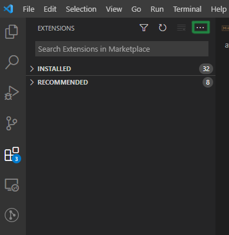

# Avatar UI Extension Pack

## Includes
### Required
- [ESLint](https://marketplace.visualstudio.com/items?itemName=dbaeumer.vscode-eslint)
- [Prettier](https://marketplace.visualstudio.com/items?itemName=esbenp.prettier-vscode)
- [Live Share](https://marketplace.visualstudio.com/items?itemName=MS-vsliveshare.vsliveshare)
- [Better Comments](https://marketplace.visualstudio.com/items?itemName=aaron-bond.better-comments)
### Optional
- [Angular Language Service](https://marketplace.visualstudio.com/items?itemName=Angular.ng-template)
- [Angular 10 Snippets](https://marketplace.visualstudio.com/items?itemName=Mikael.Angular-BeastCode)
- [Code Spell Checker](https://marketplace.visualstudio.com/items?itemName=streetsidesoftware.code-spell-checker)
- [Auto Rename Tag](https://marketplace.visualstudio.com/items?itemName=formulahendry.auto-rename-tag)
- [TypeScript Hero](https://marketplace.visualstudio.com/items?itemName=rbbit.typescript-hero)
- [Visual Studio IntelliCode](https://marketplace.visualstudio.com/items?itemName=VisualStudioExptTeam.vscodeintellicode)
- [Quokka.js](https://marketplace.visualstudio.com/items?itemName=WallabyJs.quokka-vscode)
- [Project Manager](https://marketplace.visualstudio.com/items?itemName=alefragnani.project-manager)
- [Turbo Console Log](https://marketplace.visualstudio.com/items?itemName=ChakrounAnas.turbo-console-log)

## Internal distribution and installation
Double click on VSIX file to install. If the installation fails, install it from within VSCode. Follow the steps to install manually:
 - Download the latest version of the .vsix File
 - Select Extensions (Ctrl + Shift + X)
 - Open “More Action” menu(ellipsis on the top) and click “Install from VSIX…”\
\

 - Locate VSIX file and select
 - Reload VSCode

## Generate Extension File
```vsce package```

**Enjoy!**

## Setup suggestion: 

```json
{
  "bracket-pair-colorizer-2.colors": [
    "Lightgreen",
    "LightSkyBlue",
    "Yellow",
    "Pink"
  ],
  "cSpell.userWords": [
    "jkol",
    "jkons",
    "primeng",
    "rons"
  ],
  "diffEditor.ignoreTrimWhitespace": true,
  "editor.codeActionsOnSave": {
    "source.fixAll.eslint": true
  },
  "editor.defaultFormatter": "esbenp.prettier-vscode",
  "[javascript]": {
    "editor.defaultFormatter": "esbenp.prettier-vscode"
  },
  "[typescript]": {
    "editor.defaultFormatter": "esbenp.prettier-vscode"
  },
  "eslint.codeAction.showDocumentation": {
    
    "enable": true
  },
  "eslint.format.enable": true,
  "eslint.onIgnoredFiles": "warn",
  "eslint.options": {
    
  },
  "editor.suggestSelection": "first",
  "editor.formatOnSave": true,
  "editor.tabCompletion": "on",
  "editor.cursorStyle": "line",
  "editor.minimap.enabled": true,
  "editor.minimap.showSlider": "always",
  "editor.minimap.renderCharacters": true,
  "editor.snippetSuggestions": "bottom",
  "editor.tabSize": 4,
  "extensions.autoCheckUpdates": true,
  "extensions.autoUpdate": false,
  "eslint.alwaysShowStatus": true,
  "files.autoSave": "afterDelay",
  "files.autoSaveDelay": 10000,
  "git.autofetch": true,
  "git.autoRepositoryDetection": true,
  "gitlens.hovers.currentLine.over": "line",
  "gitlens.defaultGravatarsStyle": "identicon",
  "gitlens.liveshare.allowGuestAccess": true,
  "indentRainbow.colors": [
    "rgba(40,100,55,0.3)",
    "rgba(40,100,100,0.3)",
    "rgba(100,100,0,0.3)",
    "rgba(255,105,255,0.3)"
  ],
  "indentRainbow.errorColor": "rgba(128,32,32,0.8)",
  "indentRainbow.tabmixColor": "rgba(128,32,96,0.6)",
  "indentRainbow.ignoreLinePatterns": [
    "/[ \t]* [*]/g", // lines begining with <whitespace><space>*
    "/[ \t]+[/]{2}/g" // lines begininning with <whitespace>//
  ],
  "javascript.updateImportsOnFileMove.enabled": "always",
  "json.schemas": [],
  "liveshare.connectionMode": "relay",
  "liveshare.codeLens": false,
  "liveServer.settings.donotShowInfoMsg": true,
  "prettier.requireConfig": true,
  "prettier.useEditorConfig": false,
  "problems.autoReveal": true,
  "terminal.integrated.shell.windows": "C:\\Program Files\\Git\\bin\\bash.exe",
  "typescript.updateImportsOnFileMove.enabled": "always",
  "workbench.iconTheme": "vscode-icons",
  "workbench.editor.tabCloseButton": "off",
  "window.zoomLevel": 0,
  "vsintellicode.modify.editor.suggestSelection": "automaticallyOverrodeDefaultValue",
  "vsintellicode.features.python.deepLearning": "enabled",
  "vsintellicode.typescript.completionsEnabled": true
}
```